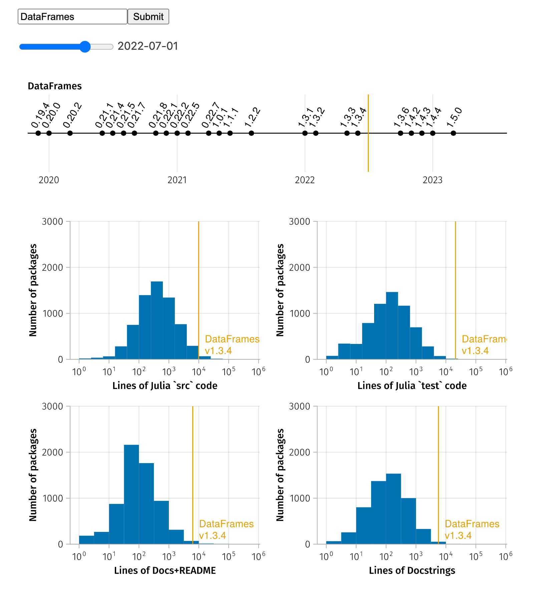

# PackageAnalyzerJuliaCon2023

[Some of the code (and data) demo'd at JuliaCon2023](https://github.com/ericphanson/PackageAnalyzerJuliaCon2023)

Here there are two notebooks:
* [`compare_to_general.jl`](./compare_to_general.jl). This notebook compares an individual package
  against all of General, with interactive widgets.
* [`analyze_manifest.jl`](./analyze_manifest.jl). This notebook presents an example analysis to understand the dependencies of an application.

To run these [Pluto.jl notebooks](https://plutojl.org/):

1. Clone this repository (`git clone https://github.com/ericphanson/PackageAnalyzerJuliaCon2023`)
2. Start Julia in this repository (I used Julia 1.9.2) with `julia --project`, and instantiate the manifest (`pkg> instantiate` or `using Pkg; Pkg.instantiate()`)
3. Start the Pluto server: `using Pluto; Pluto.run()`
4. Select the notebook of interest (either `compare_to_general.jl` or `analyze_manifest.jl`)

The notebook `compare_to_general.jl` provides a widget that lets you compare an individual package against all of General:



## Troubleshooting

The notebook `analyze_manifest.jl` calls `PackageAnalyzer.analyze`, which in turn calls `LiceneCheck.licensecheck`, which seems to crash on Apple Silicon when run in Pluto notebooks. I have not been able to figure out why. Therefore I suggest you to use Rosetta if you are running this from an Apple Silicon macbook.

If you are using [`juliaup`](https://github.com/JuliaLang/juliaup), you can do this by
```sh
juliaup add release~x64
juliaup override set release~x64
```
This will set an override to use Rosetta (x64) when launching Julia in the current directory. You can confirm by checking
```julia
julia> Sys.ARCH
:x86_64
```
